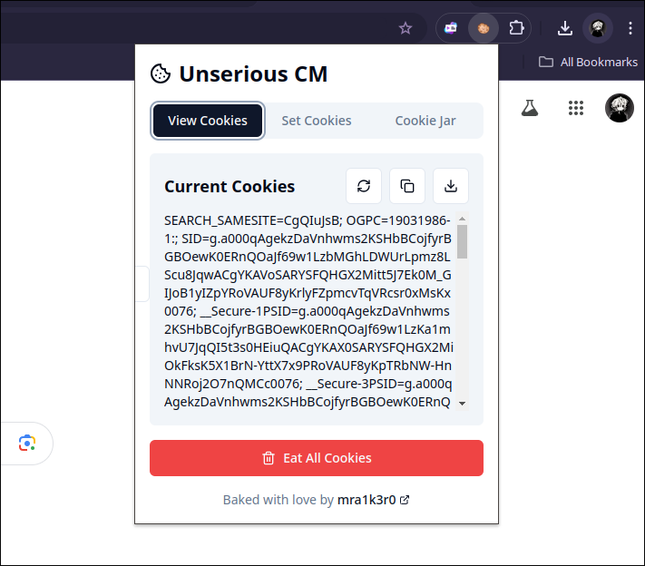
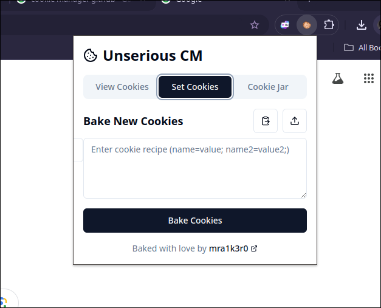
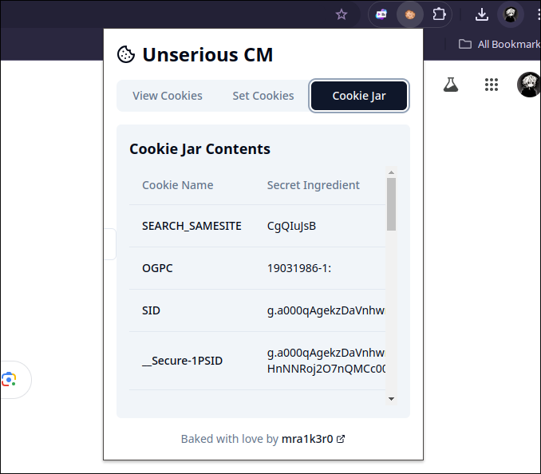

# Unserious CM: The Cookie Manager with a Twist

         _____
       .'     '.
      /.-''"'-.\
      \        /
       '.____.'
         (__) 

## About

Unserious CM: Where cookie management meets stand-up comedy. 
Because who said browser utilities can't have a sense of humor?

## Features

| Feature | Description |
|---------|-------------|
| 👁️ Peek-a-boo | Spy on your cookies (they won't notice, promise!) |
| ✨ Abracadabra | Conjure cookies out of thin air |
| 🗑️ Houdini Mode | Make cookies vanish faster than you can say "chocolate chip" |
| ↻ Time Machine | Keep your cookies fresher than a just-dropped mixtape |
| 📊 Cookie Museum | Showcase your collection like fine art |

## Screenshots

Feast your eyes on these delectable views of Unserious CM in action!

### View Cookies: The Great Cookie Stakeout


*Witness the cookie surveillance in action! No cookie can hide from our all-seeing eye!*

### Set Cookies: The Cookie Bakery


*Welcome to our state-of-the-art cookie creation lab. Bake digital delights with a click!*

### Cookie Jar: The Museum of Tiny Treasures


*Behold the grand exhibition of your cookie collection. Each one a masterpiece!*

## Quick Start

```bash
# Clone the cookie jar
git clone https://github.com/mra1k3r0/unserious-cm.git

# Preheat the oven
cd unserious-cm && npm install

# Bake to perfection (for Chrome)
npm run build:chrome

# Serve and enjoy!
# 1. Open Chrome
# 2. Visit chrome://extensions
# 3. Enable "Developer mode"
# 4. Click "Load unpacked"
# 5. Select the `dist-chrome` folder
```

## Usage

1. Click the Unserious CM icon (it's winking at you)
2. Navigate the tabs of cookie goodness
3. Manage cookies like a boss (a very silly boss)

## For the Cookie Connoisseurs (Development)

```shellscript
npm install   # Gather ingredients

# Bake for different browsers:
npm run build:chrome    # For Chrome (default)
npm run build:firefox   # For Firefox
npm run build:brave     # For Brave
npm run build:chrome-v2 # For Chrome with Manifest V2

# Bake for all browsers at once:
npm run build:all

# For development:
npm run dev
```

## Join the Cookie Rebellion

Found a bug? Got a wild idea? Want to spread the cookie love?

Fork, bake, and serve your improvements! We're always hungry for new features.
(Pull requests are like sharing your secret recipe - we can't wait to taste test!)

## The Cookie Crew

- Chief Cookie Officer: Me
- Quality Assurance: Your browser's incognito mode
- Taste Testers: You and your sweet tooth!

## Version

Current version: [v0.0.1](https://github.com/mra1k3r0/unserious-cm/releases/tag/v0.0.1) (We're just getting started!)

---

> "With great cookie power comes great responsibility to snack wisely."
> -- Uncle Ben's long-lost cousin, Aunt Gingersnap

---

Baked with ❤️ by [mra1k3r0](https://github.com/mra1k3r0)

*Remember: A cookie a day keeps the boring extensions away!*

